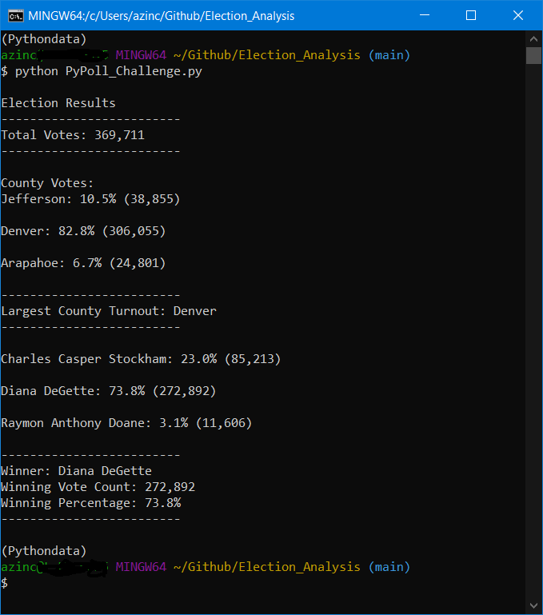
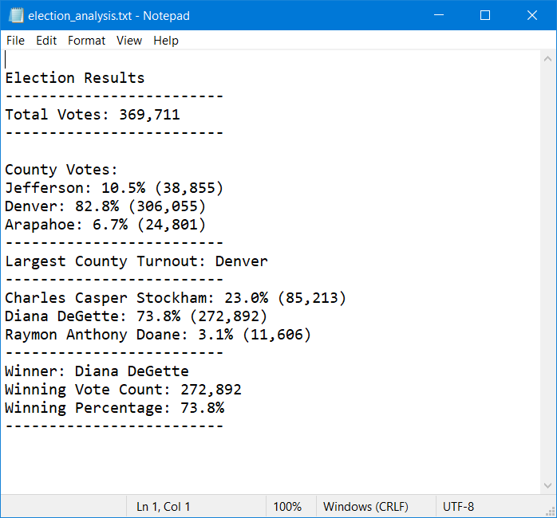

# Election_Analysis

## Overiew of this election audit analysis
A Colorado Board of Elections employee has assigned the following tasks to complete an audit of the recent local congressional election.

1. Calculate the total number of votes cast
2. Calculate the number of votes cast from each county.
3. Calculate the percentage of the votes cast from each country.
4. Determine the county with the largest voter turnout.
5. Get a complete list of candidates who received votes
6. Calculate the total number of votes that each candidate received.
7. Calculate the percentage of votes each candidate won.
8. Determine the winner of the election base on the popular vote.

The results were produced by analyzing a comma-separated value (CSV) file that contained the election data.

A python script was created to examine the file contents, row-by-row, and tally the election results.  The results were presented on-screen to the computer terminal, and were written to a text file.  The on-screen data was used to confirm that the data written to the text file was complete and correct.

Finally, a brief analysis was performed within Microsoft Excel to confirm that the script accurately counted the data.

## Resources
- Data Source: election_results.csv
- Software: Python 3.7.13, Visual Studio Code 1.70.1, OS: Windows_NT x64 10.0.19043

## Election-Audit Results
The analysis of the election shows that:

* There were 369,711 votes cast in the election
* The counties that participated in the election were:
	* Jefferson: 10.5% (38,855)
	* Denver: 82.8% (306,055)
	* Arapahoe: 6.7% (24,801)
* Denver had the largest voter turnout.
* The candidates were:
	* Charles Casper Stockham
	* Diana DeGette
	* Raymon Anthony Doane
* The candidate results were:
	* Charles Casper Stockham: 23.0% (85,213)
	* Diana DeGette: 73.8% (272,892)
	* Raymon Anthony Doane: 3.1% (11,606)
* The winner of the election was:
	* Diana DeGette, who received 73.8% of the vote and 272,892 votes.
	
## Terminal Results
The python script operation produced the following output at the operator terminal:

## Text File Results
The python script produced the following text file report of the election results:

# Election-Audit Conclusion
The python script was succussfully utilized to analyze the election data and produce a report that provides relevant details of the participating counties, candidates, and the election results.

## Future Extensions
The python script was successfully applied to the audit of this local congressional election.

With some small changes, the script could be applied to city, town, or state elections. These changes would account for the scope and type of election to present the results with meaningful labels and outcomes.  For example, the CSV file might contain the results for a town mayoral election with results reported across different town precincts.

